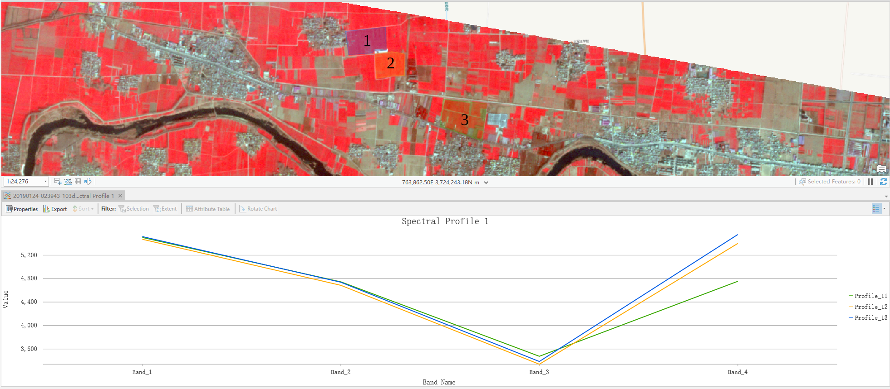

# 2019年漯河市郾城区冬小麦田间观测实验方案（基于重点研发项目）

## 1 实验目的

- 获取Sentinel-1/2、Landsat 8等卫星过境观测时的光谱、LAI、叶绿素、土壤水分等数据，在此基础上，提出、构建和验证卫星遥感监测农田作物长势和土壤状况的新方法、新模型。
- 为完成重点研发项目中作物长势、土壤状况等任务指标提供数据和方法支撑。

## 2 实验地点基本情况

郾城区，隶属河南省[漯河市](https://baike.baidu.com/item/%E6%BC%AF%E6%B2%B3%E5%B8%82)。[河南省](https://baike.baidu.com/item/%E6%B2%B3%E5%8D%97%E7%9C%81/59474)中南部，属淮河流域大沙河中游平原地区。位于东经113°45′10"～114°6′39"，北纬33°34′37"～33°44′59"。全区总面积413.1平方千米。

- 暖湿性季风气候。受季风影响，光、热、水季节分配有明显差异。

- 地势由西北向东南方向倾斜，自然坡降1/4600，属平原洼地。地面海拔高度，西部65米，东部51米，相对高差35.9米。按微地貌划分，全区土地可分为洼地、平地和岗地三个单元。

- 小麦主要品种：周麦22、周麦27、西农979、丰德存1号、百农207、漯麦9号、豫麦158，以及示范品种漯麦906、漯麦163。

- 小麦产量：500–700公斤/亩

- 小麦主要生育时期

  |        |   播种期    |   拔节期    |   抽穗期    |   扬花期    |
  | :----: | :---------: | :---------: | :---------: | :---------: |
  |  常年  | 10.08–10.15 | 03.05–03.10 | 04.10–04.15 | 04.15–04.20 |
  | 2018年 | 10.25–11.05 | 03.15–03.20 | 04.20–04.25 | 04.25–04.30 |

  根据网上检索到的有关资料，2018年秋播（2019年收获）时间与往年基本一致，据此推测，后续各生育时期应当与往年相似。

## 3 实验样区

1月24日Planet假彩色合成影像

从图中可以看出，三个样区的植被状况存在一定梯度，这有利于扩大实验数据的分布范围，可以使实验数据更具有代表性。

在每一样区内，分别取20个10 x 10的样方，在每一样方的中心和四角分别进行一次测量。这样，一共进行3 x 20 x 5次测量。

|   样方左上   |              |   样方右上   |
| :----------: | :----------: | :----------: |
|              | **样方中心** |              |
| **样方左下** |              | **样方右下** |

## 4 实验设计

考虑到17、18年实验数据已经基本可以满足中分辨率遥感影像（如MODIS）的建模和验证需求，本年度的实验力求更加精细化，针对Sentinel等高分辨率遥感影像开展研究。

### 实验一 冬小麦长势参数和土壤状况田间观测

在每一样方内的5处测量点，分别测量冠层光谱、冠层叶面积指数、株高、株密度、土壤水分等参数。

在每一样方中心处，取10 cm深处土样一份，取1行，20 cm长度范围内的小麦植株。

### 实验二 冬小麦叶绿素、氮素、水分等垂直分布研究

在每一样方内的5处测量点，各取1株小麦植株，将不同层位叶片分别收集到采样袋中。

## 5 实验测定内容

### 室外测量指标

- 冠层光谱：ASD光谱仪
- 冠层叶面积指数：LAI-2000
- 叶绿素含量：SPAD-502
- 株高：卷尺
- 株密度：卷尺 + 人工计数
- 植株鲜重
- 土壤鲜重
- 地理坐标：手持GPS

### 室内测量指标

- 植株生物量
- 植株含水量
- 植物色素含量
- 植物粗蛋白（氮）含量
- 植物氮素
- 土壤含氮量
- 土壤水分

## 6 实验记录和数据整理

参见各实验数据记录表

## 7 仪器和材料准备

- ASD光谱仪、电池、充电器
- LAI-2000
- SPAD-502
- 手持GPS 2台
- 电子天平 1台
- 卷尺 3卷
- 采样袋 500个
- 铝盒 100个
- 环刀
- 铁锹 1把
- 三角旗 20个
- 记录板、实验记录表、签字笔、5号电池
- 瓶装水（在当地购买）

## 8 参加人员（待定）

吴自华、许伟、赵聪、张兆旭等

## 9 实验日程

- 03.13 下午从北京出发，前往漯河。抵达漯河后，在漯河西站办理租车，对三个样区及周围路况等信息进行踏勘后，前往宾馆办理入住

- 03.14 观测样区1，返回后在宾馆测量植株和土壤样品鲜重，整理数据
- 03.15 观测样区2，返回后在宾馆测量植株和土壤样品鲜重，整理数据
- 03.16 观测样区3，返回后在宾馆测量植株和土壤样品鲜重，整理数据
- 03.17 上午从漯河出发，返回北京

----

补充：实验站实验样区

